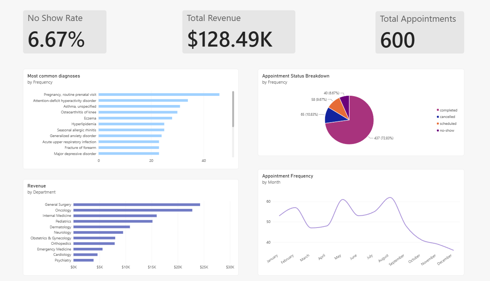

# Healthcare Analytics Dashboard

A full-stack data analytics project simulating a healthcare clinic's operations — from database design through interactive dashboarding. Built to practice and demonstrate skills across SQL, Python, and Power BI.

## Overview

This project models a healthcare clinic's core operations: patients, doctors, departments, appointments, diagnoses, prescriptions, and billing. It walks through the full analytics pipeline:

1. **Database design** — a normalized relational schema in PostgreSQL
2. **Data generation** — a realistic sample dataset (200 patients, 600 appointments, 12 departments)
3. **Python analysis** — querying the database and visualizing key metrics with pandas, matplotlib, and seaborn
4. **Power BI dashboard** — an interactive dashboard with custom DAX measures for live filtering and exploration

## Tech Stack

* **Database:** PostgreSQL
* **Languages:** SQL, Python
* **Python Libraries:** pandas, SQLAlchemy, matplotlib, seaborn, psycopg2
* **Visualization/BI:** Power BI Desktop, DAX

## Database Schema

Seven related tables, connected through primary/foreign key relationships:

* `departments` — clinic departments (Cardiology, Pediatrics, etc.)
* `doctors` — providers, linked to a department
* `patients` — patient demographic and contact information
* `appointments` — links patients to doctors, with date, reason, and status
* `diagnoses` — diagnosis codes and descriptions tied to appointments
* `prescriptions` — medications tied to appointments
* `billing` — charges, insurance coverage, and payment status tied to appointments

**Design decisions:**

* **Normalization:** Diagnoses and prescriptions are split into their own tables (rather than embedded in `appointments`) so a single appointment can have multiple diagnoses or medications without duplicating data.
* **Data integrity constraints:** `CHECK` constraints enforce valid values for categorical fields like appointment `status` and billing `payment\\\_status` directly at the database level, rather than relying on application code to catch bad data.
* **Referential integrity:** Foreign keys tie every table back to its parent record, preventing orphaned data (e.g., a billing record can't reference an appointment that doesn't exist).

## Project Structure

```
├── schema.sql          # Creates all 7 tables with constraints and relationships
├── seed\\\_data.sql       # Populates the database with realistic sample data
├── healthcare\\\_viz.py   # Python script: queries the DB and generates charts
├── screenshots/        # Power BI dashboard screenshots
└── README.md
```

## Sample Data

AI Generated to be internally consistent and realistic:

* 200 patients, 30 doctors across 12 departments
* 600 appointments (spanning 2024–2026, \~75% completed / 10% cancelled / 7% no-show / 8% scheduled)
* 448 diagnoses and 666 prescriptions, biased by department for realism (e.g., OB/GYN generates prenatal visits, Psychiatry generates mental health diagnoses)
* 542 billing records with varied insurance coverage and payment status

## Python Visualizations

`healthcare\\\_viz.py` connects to the database and generates six charts:

1. Appointment volume over time
2. Revenue by department
3. No-show rate by department
4. Top 10 most common diagnoses
5. Patient age distribution
6. Appointment status breakdown

### Setup

```bash
pip install pandas, matplotlib, seaborn, sqlalchemy, and psycopg2-binary
```

Set your database credentials as environment variables before running (credentials are not hardcoded in the script):

```bash
set DB\\\_USER=your\\\_username
set DB\\\_PASSWORD=your\\\_password
set DB\\\_NAME=your\\\_database
python healthcare\\\_viz.py
```

## Power BI Dashboard

An interactive dashboard connecting directly to the PostgreSQL database via the Npgsql connector, featuring:

* **KPI cards:** Total Appointments, Total Revenue, No-Show Rate
* **Revenue by Department** (bar chart)
* **Appointments Over Time** (line chart)
* **Appointment Status Breakdown** (donut chart)
* **Top 10 Diagnoses** (bar chart)

**Design decision:** No-Show Rate is built as a **DAX measure** (`DIVIDE(CALCULATE(COUNTROWS(appointments), appointments\\\[status] = "no-show"), COUNTROWS(appointments), 0)`) rather than a static calculated value. This means it recalculates live based on whatever filters are applied — clicking into a specific department or date range on the dashboard instantly updates the rate.



## Getting Started

1. Clone this repository
2. Run `schema.sql` against a PostgreSQL database to create the tables
3. Run `seed\\\_data.sql` to populate it with sample data
4. Set up environment variables and run `healthcare\\\_viz.py` for Python visualizations
5. Open Power BI Desktop and connect to the same database to explore the dashboard

## Author

William White -- LinkedIn URL:www.linkedin.com/in/williamwhite06 

